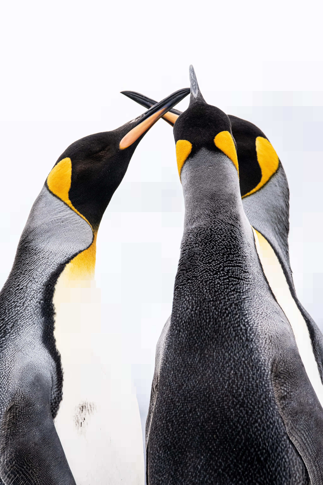

# Quadtree Compression Algorithm
 - A quick and dirty implementation of the quadtree compression algorithm in Python
 - Beneficial to install uv. 
 - Uses a progress bar in command-line if your brain need stimulation and proof of work
 - For good compression, better to use jpg than avif. avif will be orders of magnitude faster, however
    ```
    python3 compressor.py {path-to-image}
    ```


    - Original Image
    

    - Compressed and rebuilt image
    


    - Original Image
    

    - Compressed and rebuilt image
    